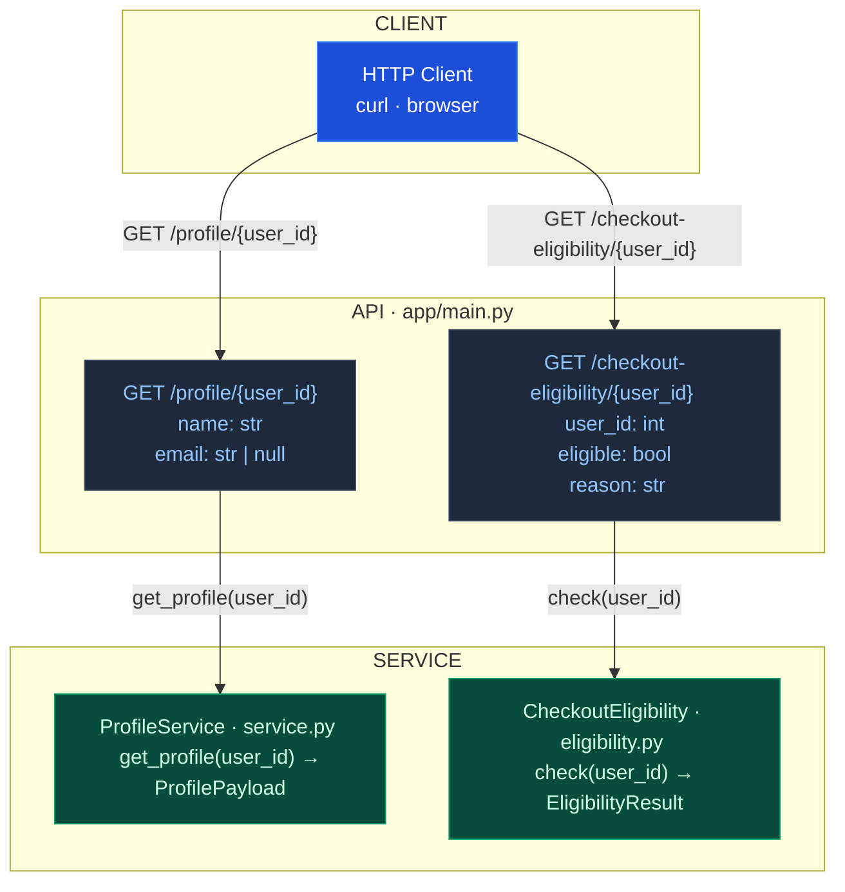

# Module 1 Teaching Repo

A minimal, runnable Python repo for **Module 1** of the AI-Assisted Development Workshop.

## Purpose

This repo is intentionally cut down to support these teaching goals:

- show that the visible error is not always where the real context lives
- show that context can be spread across:
  - endpoint behavior
  - payload shaping
  - data rules / semantics
  - supplementary tests
- help learners practice:
  - task framing
  - prompt / brief writing
  - context discovery
  - validation-first thinking

This is **not** the full integrated teaching repo. It keeps only the files needed for the Module 1 main case and simple UI demo.

## Included routes

- `GET /health`
- `GET /profile/{user_id}`
- `GET /checkout-eligibility/{user_id}`
- `GET /demo/profile-ui`

Diagram:




## Quick start

```bash
uv sync
uv run uvicorn app.main:app --reload
```

Then open:

- `http://127.0.0.1:8000/demo/profile-ui`

## Suggested Module 1 teaching order

Start with:

1. `materials/module1/issue_brief.md`
2. `materials/module1/recent_change_note.md`
3. `materials/module1/sample_logs.txt`

Then inspect:

4. `app/main.py`
5. `commerce_platform/profiles/service.py`
6. `commerce_platform/profiles/contracts.py`

Use `tests/test_profile_api.py` only as **supplementary context**, not as the first teaching material.

## Kept on purpose

- `checkout/eligibility.py`
  - to show that downstream consumers can be stricter than the profile UI
- `tests/test_profile_api.py`
  - to support the idea that validation material is also context
- `contracts.py`
  - to make nullable / missing semantics visible in the repo

## Demo prompts

Naive prompt:

> The `/profile` endpoint is broken. Please find the problem and fix it.

Better prompt:

> The `/profile` endpoint in staging is returning 500 errors and KeyError: 'email' in logs. User payload migration from old to new format is ongoing. Some requests succeed, but email display is incorrect.
> Analyze the problem and potential causes before coding.

Even better prompt:

> The `/profile` endpoint in staging is returning 500 errors, and logs show `KeyError: 'email'`.
> A user payload migration from the old format to the new format is currently ongoing.
> Some requests succeed, but email display is incorrect for some users.
>
> Do not write code yet.
> First, help me with the following:
> 1. Summarize the facts we actually know.
> 2. Distinguish confirmed facts from assumptions.
> 3. List the most plausible causes ranked by likelihood.
> 4. Point out what information is still missing.
> 5. Suggest a verification order before making code changes.
>
> Use a concise structured format.


## Not included

- discount rule case
- payment retry review case
- user summary explanation case
- full integrated materials pack
